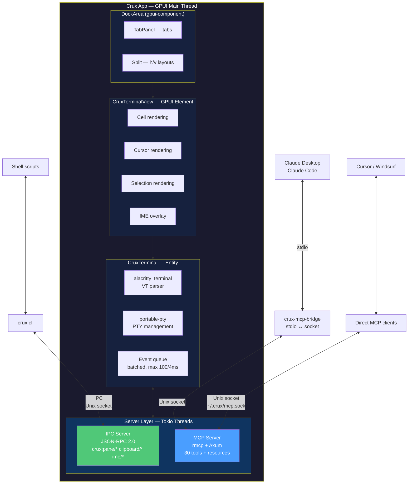
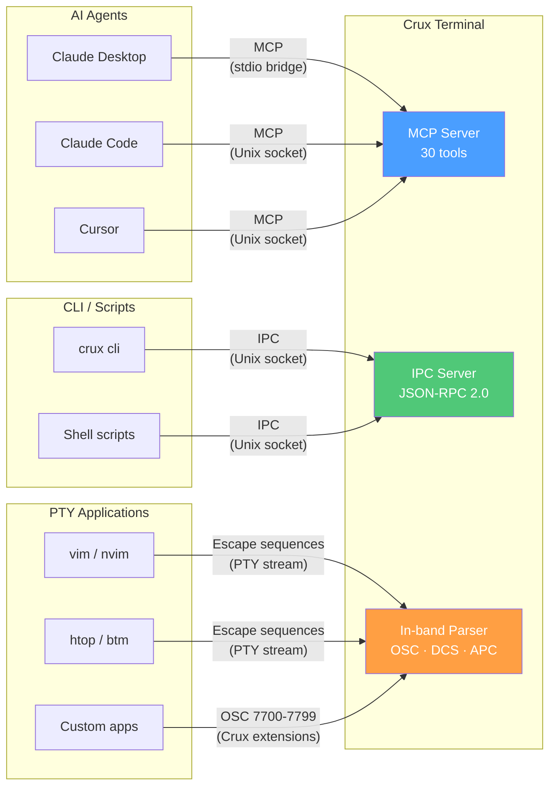
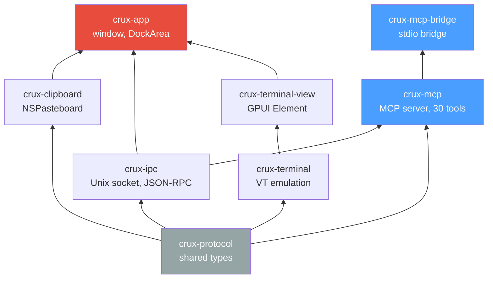

# Crux

> **crux** (n.) — the essential point; the Southern Cross constellation

A GPU-accelerated terminal emulator for macOS, built with Rust and Metal. The first terminal with a **native MCP server** — any AI agent can control Crux out of the box. Designed for the AI coding era with first-class CJK/Korean IME support, programmatic pane control, and rich clipboard input.

---

## Why Crux?

No existing terminal satisfies all of these requirements simultaneously:

| Requirement | Warp | Ghostty | WezTerm | iTerm2 | **Crux** |
|-------------|------|---------|---------|--------|----------|
| **Native MCP server** (AI agent control) | X | X | X | X | **O** |
| Modern UX (tabs, splits, MD preview) | O | △ | △ | O | **O** |
| Programmatic split-pane CLI/API | X | X | O | △ | **O** |
| tmux compatibility | X | O | O | O | **O** |
| First-class Korean/CJK IME | △ | △ | △ | △ | **O** |
| Binary clipboard input (images) | X | X | X | △ | **O** |
| GPU-accelerated rendering | O | O | O | X | **O** |
| TOML config + GUI settings + hot reload | X | △ | △ (Lua) | O (GUI only) | **O** |

**Core problem**: AI coding tools like Claude Code Agent Teams need programmatic pane control (`split-pane`, `send-text`, `list`) to orchestrate multiple agent instances. Current solutions are either closed-source cloud platforms (Warp) or external MCP wrappers bolted onto terminals via AppleScript or tmux. **No terminal has a native MCP server built in.** Crux changes this — any MCP-compatible AI agent (Claude Desktop, Claude Code, Cursor, Windsurf) can control Crux directly with zero configuration.

---

## Features

### Terminal Core
- **Metal GPU rendering** via GPUI framework — targeting 120 FPS
- **Full VT100/xterm emulation** powered by `alacritty_terminal`
- **True color** (24-bit RGB) + 256 color support
- **SGR mouse events**, bracketed paste, focus events
- **Scrollback buffer** with regex search (default 10,000 lines)
- **Unicode grapheme clusters** (Mode 2027) — correct emoji and CJK rendering

### UI/UX
- **Tabs** with drag reordering
- **Split panes** — horizontal/vertical with resizable dividers
- **Markdown preview** — inline rendered markdown output
- **Clickable links** — URL detection + OSC 8 hyperlinks
- **Theme system** — dark/light modes with customizable color schemes

### Korean/CJK IME (Key Differentiator)
- **NSTextInputClient** full protocol implementation
- **Hangul composition overlay** — preedit text rendered separately from PTY buffer
- **Accurate candidate window positioning** via `firstRectForCharacterRange`
- **Modifier key isolation** during composition (prevents Ghostty-style preedit destruction)
- **IME/keyboard event deduplication** (prevents Alacritty-style double space)
- **Vim mode auto-switch** — detect cursor shape changes, auto-toggle IME to ASCII in Normal mode

### Rich Clipboard & Input
- **Binary clipboard paste** — images from NSPasteboard saved to temp files
- **Drag & drop** — files and images via NSDraggingDestination
- **Content type detection** — text, HTML, images, file URLs
- **Sideband channel** for rich input separate from PTY text stream

### Native MCP Server (Key Differentiator)
- **Built-in MCP server** — no external wrapper, no AppleScript overhead
- **30 MCP tools** across pane management, command execution, state inspection, content capture
- **Any AI agent works instantly** — Claude Desktop, Claude Code, Cursor, Windsurf, Copilot
- **`crux_coordinate_panes`** — declarative multi-service orchestration in a single tool call
- **`crux_screenshot_pane`** — GPU-rendered visual capture for AI vision
- **`crux_wait_for_output`** — pattern-matching output monitor with timeout
- **`crux_type_with_ime`** — CJK input simulation (only MCP terminal with IME support)
- **`crux_load_workspace`** — predefined multi-pane layouts for agent teams
- **stdio bridge** (`crux-mcp-bridge`) for Claude Desktop compatibility

### Crux Protocol (IPC)
- **Unix domain socket** + JSON-RPC 2.0 protocol
- **CLI client** (`crux cli split-pane`, `send-text`, `get-text`, `list`)
- **Claude Code Agent Teams** native backend support
- **Event subscription** — pane lifecycle, output, focus changes
- **Triple protocol** — MCP for AI agents + IPC for CLI/programmatic control + in-band escape sequences for PTY apps
- **Custom OSC 7700-7799** namespace for Crux-specific extensions

### Configuration
- **TOML format** — type-safe, Rust-native, with typo detection (`deny_unknown_fields`)
- **GUI settings** (⌘,) — visual settings editor powered by gpui-component widgets
- **Bidirectional sync** — GUI edits write TOML, TOML edits update GUI in real-time
- **Hot reload** — edit config, changes apply instantly (no restart)
- **Live preview** — see font, color, and opacity changes as you adjust them
- **XDG-first** — `~/.config/crux/config.toml` with macOS native fallback
- **Layered merging** — CLI flags > env vars > config file > defaults
- **CJK font fallback chain** — ordered fallback for Korean/Chinese/Japanese glyphs
- **`crux --generate-config`** — annotated default config as documentation
- **`crux --check-config`** — validate config without launching

### tmux Compatibility
- Full VT100 feature set required by tmux
- True color passthrough (`Tc` / `RGB` terminfo flags)
- SGR mouse mode, bracketed paste, focus events
- **tmux Control Mode** (`-CC`) integration (long-term goal)

---

## Configuration

Crux uses **TOML** — the same format as `Cargo.toml`. Type-safe, human-readable, and catches typos at parse time. Both a **GUI settings window** (⌘,) and direct TOML editing are supported with bidirectional sync.

### GUI Settings (⌘,)

A native settings window built with gpui-component widgets. Every change is written back to `config.toml` — no hidden state, no proprietary format.

| Tab | Settings |
|-----|----------|
| **General** | Shell, startup behavior, working directory |
| **Appearance** | Font family/size, colors, theme, opacity, blur |
| **Terminal** | Scrollback, cursor style/blink, mouse mode |
| **Keybindings** | Visual key recorder, conflict detection |
| **IME** | Input source, Vim auto-switch, composition overlay |
| **MCP** | Security policy, allowed tools, socket path |

Changes preview live as you adjust sliders and pickers — no "Apply" button needed.

### Config File Location

```
~/.config/crux/config.toml          # XDG default (recommended)
~/Library/Application Support/com.crux.terminal/config.toml  # macOS native
```

Override with environment variables: `CRUX_FONT_SIZE=16`, `CRUX_WINDOW_OPACITY=0.95`

### Example

```toml
# ~/.config/crux/config.toml

[font]
family = "JetBrains Mono"
size = 14.0
ligatures = false

[font.fallback]
families = ["Apple SD Gothic Neo", "PingFang SC", "Noto Sans Mono CJK KR"]

[colors]
foreground = "#c0caf5"
background = "#1a1b26"

[terminal]
scrollback_lines = 10000
cursor_style = "block"       # block, underline, beam
cursor_blink = false

[shell]
program = "/bin/zsh"
args = ["-l"]
integration = true           # OSC 7, OSC 133 shell integration

[window]
opacity = 1.0
blur = false
decorations = "full"         # full, none

[[keybindings]]
key = "n"
mods = "super"
action = "new_window"
```

### Hot Reload

Most settings apply instantly when the config file is saved — no restart needed.

| Hot Reloadable | Restart Required |
|---------------|------------------|
| Colors, themes | Scrollback size |
| Font family/size | Shell program |
| Cursor style/blink | Window decorations |
| Window opacity | IPC socket path |
| Keybindings | — |

### Config Format Comparison

| Terminal | Format | GUI Settings | Hot Reload | Typo Detection |
|----------|--------|-------------|------------|----------------|
| Alacritty | TOML | No | Yes | Partial |
| Kitty | Custom `.conf` | No | Yes | No |
| Ghostty | Custom `key=value` | No | Partial | No |
| WezTerm | Lua (scripting) | No | Yes | Runtime errors |
| iTerm2 | plist (hidden) | Yes (GUI only) | N/A | N/A |
| **Crux** | **TOML** | **Yes (⌘, + bidirectional)** | **Yes** | **Yes** (`deny_unknown_fields`) |

---

## Architecture



### Triple Protocol



---

## Tech Stack

| Component | Crate / Technology | Version | Purpose |
|-----------|-------------------|---------|---------|
| UI Framework | `gpui` | 0.2.2 | Metal GPU rendering, Flexbox layout, event system |
| UI Components | `gpui-component` | 0.5.1 | DockArea, Tabs, Resizable panels, 60+ widgets |
| VT Parser | `alacritty_terminal` | 0.25 | Terminal emulation, grid, search, selection, damage tracking |
| PTY | `portable-pty` | 0.9.0 | PTY creation, resize, process management |
| macOS Bindings | `objc2` + `objc2-app-kit` | latest | NSTextInputClient, NSPasteboard, NSDragging |
| MCP SDK | `rmcp` | 0.15.0 | Native MCP server (Model Context Protocol) |
| HTTP Server | `axum` | 0.8 | MCP Unix socket / HTTP transport |
| Async Runtime | `tokio` | latest | Unix socket IPC server, MCP server, async I/O |
| Unicode | `unicode-width` + `unicode-segmentation` | latest | wcwidth, grapheme clusters (UAX #29) |
| Serialization | `serde` + `serde_json` | latest | JSON-RPC protocol |
| Image | `image` + `base64` | latest | Kitty Graphics Protocol, clipboard images |
| Config | `toml` + `notify` | 0.8 / 7 | TOML parsing, file watch for hot reload |
| Text Shaping | CoreText (macOS native) | — | Font fallback, CJK glyph rendering |

---

## Environment Variables

| Variable | Description |
|----------|-------------|
| `TERM` | `xterm-crux` (fallback: `xterm-256color`) |
| `COLORTERM` | `truecolor` |
| `TERM_PROGRAM` | `Crux` |
| `TERM_PROGRAM_VERSION` | Current version |
| `CRUX_SOCKET` | IPC Unix socket path |
| `CRUX_MCP_SOCKET` | MCP server Unix socket path (default: `~/.crux/mcp.sock`) |
| `CRUX_PANE` | Current pane ID |
| `LANG` | Inherited (e.g., `ko_KR.UTF-8`) |

---

## CLI Usage

```bash
# Split pane and run a command
crux cli split-pane --right --percent 30 -- claude --teammate

# Send text to a pane
crux cli send-text --pane-id 42 --no-paste "ls -la\n"

# Read pane content
crux cli get-text --pane-id 42

# List all panes (JSON)
crux cli list --format json

# Activate a pane
crux cli activate-pane --pane-id 42
```

---

## MCP Integration

Crux is the first terminal emulator with a **native MCP (Model Context Protocol) server**. Any MCP-compatible AI tool can control Crux without external wrappers.

### Claude Desktop Setup

Add to `~/Library/Application Support/Claude/claude_desktop_config.json`:

```json
{
  "mcpServers": {
    "crux-terminal": {
      "command": "crux-mcp-bridge",
      "args": ["--socket", "~/.crux/mcp.sock"]
    }
  }
}
```

### Available MCP Tools (30)

| Category | Tools | Examples |
|----------|-------|---------|
| **Pane Management** (5) | create, close, focus, list, resize | `crux_create_pane`, `crux_list_panes` |
| **Command Execution** (5) | execute, send_keys, send_text, get_output, wait_for_output | `crux_execute_command`, `crux_wait_for_output` |
| **State Inspection** (5) | cwd, process, pane_state, selection, scrollback | `crux_get_current_directory` |
| **Content Capture** (5) | screenshot, raw_text, formatted, save/restore session | `crux_screenshot_pane` |
| **Differentiation** (10) | structured output, visual diff, IME input, clipboard, workspace layouts, streaming, pane coordination, context injection, snapshots, intent detection | `crux_coordinate_panes`, `crux_type_with_ime` |

### Example: Multi-Service Orchestration

An AI agent can start a full-stack environment with a single MCP tool call:

```json
{
  "tool": "crux_coordinate_panes",
  "input": {
    "steps": [
      { "pane": "backend",  "command": "cargo run",     "wait_for": "Listening on 0.0.0.0:8080" },
      { "pane": "frontend", "command": "npm run dev",    "wait_for": "ready in" },
      { "pane": "test",     "command": "cargo test --test e2e" }
    ]
  }
}
```

---

## Crux Protocol

Hierarchical namespace: `crux:<domain>/<action>`

| Protocol | Domain | Methods | Priority |
|----------|--------|---------|----------|
| **IPC** | `crux:pane/*` | split, send-text, get-text, list, activate, close, resize, move | P0 |
| **IPC** | `crux:window/*` | create, list, close | P0 |
| **IPC** | `crux:clipboard/*` | read, write (text, HTML, images) | P1 |
| **IPC** | `crux:ime/*` | get-state, set-input-source | P1 |
| **IPC** | `crux:render/*` | image, markdown | P2 |
| **IPC** | `crux:events/*` | subscribe, unsubscribe | P1 |
| **MCP** | `crux_*` | 30 tools (pane, execute, state, content, differentiation) | P0 |

See the [Triple Protocol diagram](#triple-protocol) above for the full architecture.

---

## Building

```bash
# Prerequisites
rustup update stable
cargo install create-gpui-app  # optional scaffolding tool

# Build
cd crux
cargo build --release

# Run
cargo run --release
```

Requires macOS 13+ (Ventura) for Metal rendering.

---

## Project Structure

```
crux/
├── crates/
│   ├── crux-app/           # Main application, window management
│   ├── crux-terminal/      # Terminal entity, VT integration, PTY
│   ├── crux-terminal-view/ # GPUI rendering, IME overlay, selection
│   ├── crux-ipc/           # Unix socket server, JSON-RPC, CLI client
│   ├── crux-mcp/           # Native MCP server (30 tools, rmcp SDK) [planned]
│   ├── crux-mcp-bridge/    # stdio ↔ Unix socket bridge for Claude Desktop [planned]
│   ├── crux-clipboard/     # Rich clipboard, drag & drop
│   └── crux-protocol/      # Protocol types, Crux Protocol definitions
├── research/               # Technical research documents
├── README.md
├── PLAN.md
└── Cargo.toml
```

### Crate Dependency Graph



---

## Research

Extensive technical research (~780KB, 28 documents) is available in [`research/`](research/README.md):

| Area | Key Documents |
|------|--------------|
| **GPUI Framework** | [framework.md](research/gpui/framework.md), [terminal-implementations.md](research/gpui/terminal-implementations.md), [bootstrap.md](research/gpui/bootstrap.md), [widgets-integration.md](research/gpui/widgets-integration.md) |
| **Terminal Core** | [terminal-emulation.md](research/core/terminal-emulation.md), [terminal-architecture.md](research/core/terminal-architecture.md), [keymapping.md](research/core/keymapping.md), [terminfo.md](research/core/terminfo.md), [config-system.md](research/core/config-system.md) |
| **Integration** | [ipc-protocol-design.md](research/integration/ipc-protocol-design.md), [claude-code-strategy.md](research/integration/claude-code-strategy.md), [mcp-integration.md](research/integration/mcp-integration.md) |
| **Platform** | [ime-clipboard.md](research/platform/ime-clipboard.md), [homebrew-distribution.md](research/platform/homebrew-distribution.md), [vim-ime-switching.md](research/platform/vim-ime-switching.md) |
| **Competitive** | [ghostty-warp-analysis.md](research/competitive/ghostty-warp-analysis.md), [terminal-structures.md](research/competitive/terminal-structures.md) |

---

## License

Dual-licensed under [MIT](LICENSE-MIT) and [Apache 2.0](LICENSE-APACHE). You may choose either license.

---

## Name

**Crux** — Latin for "the essential point" and the name of the Southern Cross constellation. It represents both the core problem this terminal solves (the crux of terminal UX for AI coding) and navigational guidance (the Southern Cross has guided travelers for millennia).

The name is also designed to become a protocol namespace: `crux:<domain>/<action>`.
